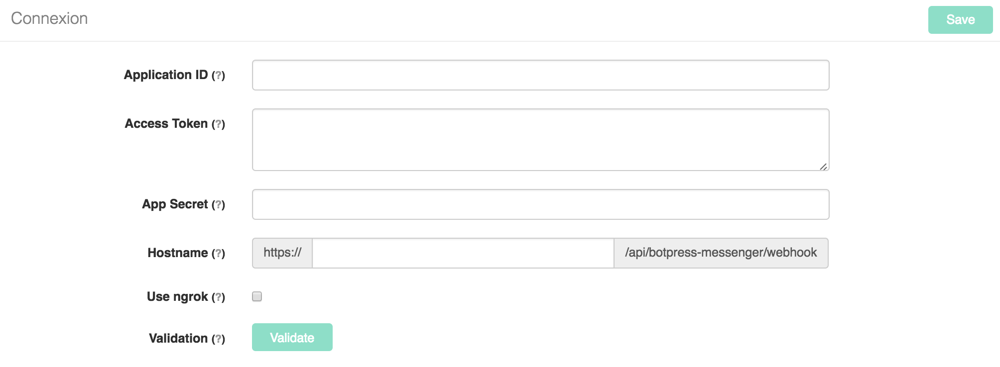

# botpress-messenger

Official Facebook Messenger connector for Botpress. This module has been build to accelerate and facilitate development of Messenger's bots.

## Installation

Installing modules on Botpress is simple. By using CLI, users only need to type this command in their terminal to add messenger module to their bot.

``` 
botpress install messenger
```

It's also possible to install it with Botpress UI in modules section.


## Get started

To setup connexion of your chatbot to Messenger, you need to fill connexion settings directly in module interface. In fact, you only need to follow these 5 steps and your bot will be active.



##### 1. Create a [**Facebook page**](https://www.facebook.com/pages/create) and a [**Messenger application**](https://developers.facebook.com).
  


##### 2. Get App ID and App Secret
These information are available on dashboard of developers page. You only need to copy them in module interface.


##### 3. Get Access token
Acces token is available in Messenger section of developers. You need to copy it in the appropriate section of botpress-messenger UI.


##### 4. Setup Hostname

  4.1. You need to manually enter your hostname or you cans use **[ngrok](#ngrok)** to locally deploy your chatbot ([learn more about ngrok]((https://ngrok.com))

  4.2. You don't have to setup webhook on Facebook developers page, this module automatically do it for you via Facebook API.

##### 5. Validate and Connect! 

To see in details how to configure completly this module, videos are available on our Youtube Channel \(soon\).


## Features

### Incoming

* [Text messages](#text-messages) 
* [Postbacks](#postbacks)
* [Referrals](#referrals)

### Outgoing

* [Text messages](#text-messages)
* [Attachments](#attachments)
* [Templates](#templates)
* [Quick replies](#quick-replies)
* [Automatic typing indicator](#automatic-typing-indicator)
* [Postbacks](#postbacks)
* [Referrals](#referrals)
* [Display Get Started](#display-get-started)
* [Greeting message](#greeting-message)
* [Persistent menu](#persistent-menu)
* [Automatically mark as read](#automatically-mark-as-read)
* [Trusted domains](#trusted-domains)
* 
* Save users in DB
* Automatic profile lookup
* Webhook security check

## Reference

### Incoming


#### Text messages

#### Postbacks

#### Referrals

### Outgoing

This module 

### Text messages

In code, it is simple to send a message text to a specific users ([facebook doc](https://developers.facebook.com/docs/messenger-platform/send-api-reference/text-message)).

#### sendText(userId, text, [options])

##### Arguments

1. ` userId ` (_String_): Correspond to unique Messenger's recipient identifier. Usually, this `recipient_id` is available from input message.

2. ` text ` (_String_): Text message that will be send to user.

3. ` options ` (_Object_): An object that may contains `quick_replies` or `typing` indicator. These specific options will be added to the associated message. 

##### Returns

(_Void_): Send to outgoing middlewares a formatted `Object` than contains all information (platform, type, text, raw) about the text message that needs to be sent to Messenger platform.

##### Example

```
const userId = 'USER_ID' //TODO
const text = "Select between these two options?"
const options = {
    quick_replies: [
        {
            content_type: "text",
            title: "Option 1",
            payload: "DEVELOPER_DEFINED_PAYLOAD_FOR_OPTION_1"
        },
        {
            content_type:"text",
            title:"Option 2",
            payload: "DEVELOPER_DEFINED_PAYLOAD_FOR_OPTION_2"
        }
    ],
    typing: true
}

bp.messenger.pipeText(userId, text, options)
```

### Attachments

By using this function, you can send any type of attachment to your users ([facebook doc](https://developers.facebook.com/docs/messenger-platform/send-api-reference/contenttypes)).

#### sendAttachment(userId, type, url, [options])

##### Arguments

1. ` userId ` (_String_): Correspond to unique Messenger's recipient identifier

2. ` type ` (_String_): Specific type of  attachment can be `'audio'`, `'file'`, `'image'` or `'video'` 

3. ` url ` (_String_): Correspond to specific url of the attachment that need to be sent.

4. ` options ` (_Object_): An object that may contains `quick_replies` or `typing` indicator. These specific options will be added to the associated attachment. 

##### Returns

(_Void_): Send to outgoing middlewares a formatted `Object` than contains all information (platform, type, text, raw) about the attachment that needs to be sent to Messenger platform.

##### Example

```
const userId = 'USER_ID' //TODO
const type = 'image'
const url = 'https://github.com/botpress/botpress/blob/master/images/botpress-dark.png?raw=true'

bp.messenger.sendAttachment(userId, type, url)
```

### Templates

By using this module, it's easy to send any type of supported template to your users ([facebook doc](https://developers.facebook.com/docs/messenger-platform/send-api-reference/templates)).

#### sendTemplate(userId, payload, [options])

##### Arguments

1. ` userId ` (_String_): Correspond to unique Messenger's recipient identifier

2. ` payload ` (_Object_): Specific `payload` object for your selected template. Actually, many types of template (button, generic, list, receipt...) are supported by Messenger.

3. ` options ` (_Object_): An object that may contains `typing` indicator. It's not possible to add `quick_replies` to a template.

##### Returns

(_Void_): Send to outgoing middlewares a formatted `Object` than contains all information (platform, type, text, raw) about the template that needs to be sent.

##### Example

```
const userId = 'USER_ID' //TODO
const payload = {
    template_type: "button",
    text: "Have you seen our awesome website?",
    buttons: [
        {
            type: "web_url",
            url: "https://www.botpress.io",
            title: "Show Website"
        }
    ]
}

bp.messenger.sendTemplate(userId, payload)
```

#### Quick replies
By using `options` argument, you can easily add quick replies to text messages or attachments. 

```
const options = {
    quick_replies: [
        {
            content_type :"text",
            title: "Option",
            payload: "DEVELOPER_DEFINED_PAYLOAD_FOR_OPTION"
        }
    ]
}
``` 

#### Automatic typing indicator

As quick replies, you can add an automatic typing indicator to your messages by adding `typing` to `options` argument.

```
const options = { typing: true }
```


#### Postbacks

//TODO This module support postbacks. Postbacks occur when a Postback button, Get Started button, Persistent menu or Structured Message is tapped ([facebook doc](https://developers.facebook.com/docs/messenger-platform/webhook-reference/postback)).

#### Referrals

//TODO This module also support referrals. In fact, the value of the `ref` parameter is passed by the server via webhook and we are able to access these referrals in parameters of input messages ([facebook doc](https://developers.facebook.com/docs/messenger-platform/webhook-reference/referral)). 

#### Display Get Started

To active get started button on Messenger, users can modify display setting directly in user interface ([facebook doc](https://developers.facebook.com/docs/messenger-platform/thread-settings/get-started-button)).


#### Greeting message

Directly in module view, users are able to modify greeting message ([facebook doc](https://developers.facebook.com/docs/messenger-platform/thread-settings/greeting-text)).


#### Persistent menu

Users can directly modify persistent menu in module user interface. By using UI, it's possible to add, modify and remove items \([facebook doc](https://developers.facebook.com/docs/messenger-platform/thread-settings/persistent-menu)\).


#### Automatically mark as read

Directly in UI, users can setup if they want to automatically mark all messages as read ([facebook doc](https://developers.facebook.com/docs/messenger-platform/webhook-reference/message-read)).


#### Trusted domains

By using UI, users can configure \(add, modify and remove\) trusted domains ([facebook doc](https://developers.facebook.com/docs/messenger-platform/thread-settings/domain-whitelisting)).


#### Automatic profile lookup

#### Save users in Database

#### Webhook security check

## Example

* Botpress examples \(soon\).
* Youtube Channel \(soon\).

### Community

### License

botpress-messenger is licensed under AGPL-3.0

